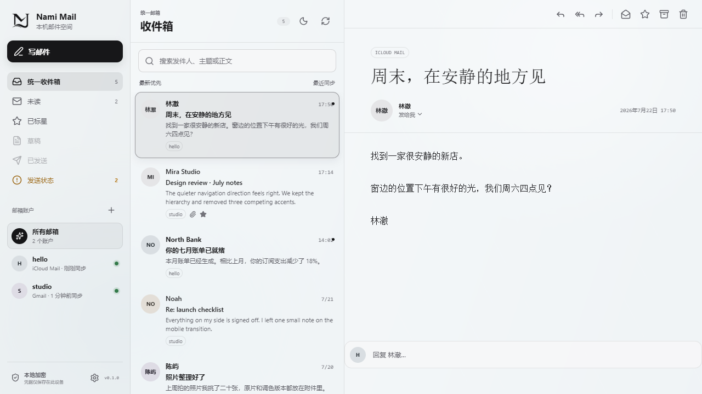

# Nami Mail

<p align="center">
  
</p>

Nami Mail 是一个本地优先的多账户邮件客户端。它把 Gmail、iCloud、QQ、163、Outlook/Hotmail、Yahoo、AOL、Fastmail、Yandex 以及其他支持 IMAP/SMTP 的邮箱集中到由你本机运行的统一收件箱中。常见邮箱可使用应用专用密码/授权码；已配置的 Google 与 Microsoft 账户可使用 OAuth 2.0 登录。

<p align="center">
  
</p>

> 密码输入框只用于服务商要求的长期专用凭据：Gmail 和 iCloud 通常填写应用专用密码，QQ/网易填写客户端授权码，普通自建邮箱填写邮箱密码。凭据不会发送到 Nami Mail 以外的服务，只用于直接连接对应邮箱服务商；OAuth 刷新令牌同样仅加密保存在本机。

## 获取和首次使用

面向日常使用，请只从 [GitHub Releases](https://github.com/QinIndexCode/nami-mail/releases) 下载 Windows x64 的 `Nami Mail Setup <version>.exe`。`zip` 和 `json` 资源是应用自动更新使用的受校验资源，不是手动安装包；从源码运行的方式仅适用于开发和贡献。

首次安装、Windows SmartScreen、同版本重装、降级保护、数据保留、卸载与自动更新的用户路径见 [Windows 安装与更新指南](docs/INSTALLING.md)。邮箱的认证准备、服务商差异、OAuth 前置条件和手动配置说明见 [邮箱接入指南](docs/EMAIL-PROVIDERS.md)。

## 文档

- [Windows 安装与更新指南](docs/INSTALLING.md)：下载、安装、首次启动、卸载、更新提示和 SmartScreen 风险说明。
- [邮箱接入指南](docs/EMAIL-PROVIDERS.md)：服务商认证准备、OAuth、手动 IMAP/SMTP 和常见连接问题。
- [隐私与本地数据说明](docs/PRIVACY.md)：本地保存内容、加密边界和第三方连接。
- [支持指南](SUPPORT.md)：邮箱接入、网络问题和适合提交 Issue 的内容。
- [安全策略](SECURITY.md)：私下报告漏洞的方式和范围。
- [贡献指南](CONTRIBUTING.md)、[社区行为准则](CODE_OF_CONDUCT.md)、[开发说明](docs/DEVELOPMENT.md) 与 [架构与信任边界](docs/ARCHITECTURE.md)：本地开发、协作边界、测试、进程边界和 Pull Request 要求。
- [Windows 发布指南](docs/RELEASING.md)、[Release Notes](docs/releases/README.md) 与 [变更日志](CHANGELOG.md)：签名、GitHub Release、面向用户的版本说明和发行验证。

## 运行

需要 Node.js 22.14.0 或更高版本。

```powershell
# 在本项目根目录执行
npm.cmd install
npm.cmd run build
npm.cmd start
```

浏览器打开 [http://127.0.0.1:3187](http://127.0.0.1:3187)。开发模式使用：

```powershell
npm.cmd run dev
```

开发服务直接使用根目录的 `better-sqlite3`。Windows x64 的 v13 使用 `prebuilds/win32-x64.node` N-API 预编译模块，命令行 Node 与 Electron 都会分别执行真实查询验证该文件；不需要在项目中交换 ABI 专用二进制文件。可单独验证两个运行时的加载路径：

```powershell
npm.cmd run verify:node-sqlite
npm.cmd run verify:electron-sqlite
npm.cmd run smoke:server-node
```

## Windows 桌面安装包

Nami Mail 可以作为原生 Windows 应用运行。邮件界面、交互和动画与 Web 版共用同一套 React/CSS 实现。

普通用户应使用 Release 中的 `Nami Mail Setup <version>.exe`，不要把更新 ZIP 解压后直接运行。安装前和遇到 Windows 信任提示时，请按 [Windows 安装与更新指南](docs/INSTALLING.md) 核对来源与签名状态。

```powershell
npm.cmd install
npm.cmd run package:win
```

构建完成后，安装程序位于 `release-artifacts/<package.json version>/Nami Mail Setup <package.json version>.exe`。安装后的本地数据库和加密主密钥保存在当前 Windows 用户的 `%APPDATA%\Nami Mail\data`，不会写入安装目录，也不会将开发环境的 `data/` 打入安装包。

### 安装、更新与卸载

- 已安装相同版本时，交互式安装程序会让用户选择重新安装或直接保留现有安装；静默部署仍可安全地重复安装相同版本。
- 已安装版本低于当前安装包时，安装程序会明确说明这是升级，并保留本地数据。
- 已安装版本高于当前安装包时，交互式安装程序会默认取消降级，只有明确确认后才继续；静默降级必须额外传入 `--nami-allow-downgrade`，否则退出码为 `3`。
- 卸载时会询问是否同时删除当前 Windows 用户的 Nami Mail 本地数据，默认保留。选择删除只会移除 `%APPDATA%\Nami Mail`，其中包括本地数据库、加密密钥、已保存设置和 OAuth 公共配置，不会删除邮箱服务商上的邮件。静默卸载默认保留数据；需要显式删除时使用 `Uninstall Nami Mail.exe /S --nami-delete-data`。通过 `NAMI_MAIL_USER_DATA_DIR` 指定的测试或自定义目录不会被安装程序自动删除。

桌面版与 Web 服务端都使用 SQLite 原生模块。`better-sqlite3 13` 在 Windows x64 使用同一个 N-API 预编译模块；桌面启动或打包前，项目会实际验证 Electron 能加载根目录模块。

面向普通 Windows 用户的公开分发，强烈建议使用带时间戳的 Authenticode 证书签名最终安装程序；未签名安装程序仍可依靠 Ed25519 清单信任根进行更新，但 Windows SmartScreen 可能显示来源警告。

### GitHub 自动更新

正式 Windows 安装版会在启动后检查 [GitHub Releases](https://github.com/QinIndexCode/nami-mail/releases) 中更高的稳定版本；常驻期间会定期检查，临时网络失败会采用退避重试。检查只请求公开的 Release 元数据，不会把 GitHub 访问令牌、邮箱凭据或邮件内容发送到 GitHub。

发现新版本时，应用会以符合当前主题的应用内提示让用户选择：

- **更新此版本**：下载 ZIP 更新包并在本机复核，完成后再由用户选择“重启并更新”；不会在发现更新时擅自下载或重启。
- **跳过此版本**：不再提示该版本；若已经下载，会同时清理该版本的本地 ZIP 缓存。
- **稍后提醒**：可选择 1 小时、明天、一周或 30 天后再提示。撰写、账户连接、设置、发送状态等重要操作进行中时，提示会等待，不会抢走当前工作。

下载前后都会检查 Release 版本、资源名称、大小和 ZIP 的 SHA-512。Ed25519 发行版会先验证 JSON 清单签名，再用清单绑定 ZIP；Authenticode 发行版还会复核解出的安装程序与当前安装程序属于同一签名者。更新 ZIP 只能包含一个根目录下的 NSIS 安装程序，安装助手会再次核对 ZIP 后才以静默升级方式运行。

安装成功后，助手会对下载 ZIP 和临时展开目录最多清理 5 次，并在每次递增的 100 毫秒等待后复查是否仍然存在。若仍有残留，新版本下次启动时只会在对应版本的更新缓存中再次尝试清理：清理成功显示非打断式处理结果，仍无法清理则保留错误状态；Windows 上同一用户的其他进程仍可能锁定或改名文件，因此不能承诺绝对删除。安装异常时，助手只记录版本、失败阶段和时间，并在按启动前哈希复核后尽力重新打开旧版；无法自动恢复时，用户下次手动启动会看到恢复状态。若本地邮件服务或发件队列不能安全关闭，更新不会启动，应用仍可继续使用。

正式发布至少要提供一种信任根：当前安装程序的有效 Authenticode 签名，或内置到安装包资源中的 Ed25519 公钥。前者会把新安装程序限定为与当前程序相同的签名者；后者会要求 GitHub JSON 清单带有对应私钥生成的 Ed25519 签名。没有有效 GitHub 更新配置或信任根的开发运行、普通本地安装包会明确显示为“未启用”，不会访问未知地址。

构建 GitHub 更新包时必须指向公开仓库 `QinIndexCode/nami-mail`（或维护者明确迁移后的公开仓库）。默认输出已按当前版本隔离到 `release-artifacts/<package.json version>`；正式发布或并行验证仍应显式设置 `release-artifacts/<版本>`，避免旧构建物混入本次资源集：

```powershell
$env:NAMI_MAIL_GITHUB_REPOSITORY="QinIndexCode/nami-mail"
$env:NAMI_MAIL_RELEASE_DIRECTORY="release-artifacts/0.1.0"
# 至少配置以下两类信任根之一；私钥只存在于当前进程或 GitHub Secrets 中。
$env:NAMI_MAIL_UPDATE_ED25519_PRIVATE_KEY="<Base64 PKCS#8 Ed25519 private key>"
# 如使用 Authenticode，还需要独立固定签名身份：
# $env:CSC_LINK="<certificate path, URL, or base64>"
# $env:CSC_KEY_PASSWORD="<certificate password>"
# $env:NAMI_MAIL_EXPECTED_WINDOWS_PUBLISHER="<certificate SimpleName or full Subject>"
# $env:NAMI_MAIL_EXPECTED_WINDOWS_CERTIFICATE_THUMBPRINT="<40-character SHA-1 thumbprint>"
npm.cmd run package:win:github
```

`package:win:github` 会确认仓库公开、生成安装程序、`latest.yml`、blockmap、版本化 ZIP 与 JSON 清单，并运行安装包 smoke；它不会发布。正式发布使用 `npm.cmd run publish:github` 或推送精确的 `v<package.json version>` 标签。发布先创建草稿 Release，再重新下载并核对下列五项资产的大小和 SHA-256，全部一致才提升为正式 Release：

1. `Nami Mail Setup <version>.exe`
2. `Nami Mail Setup <version>.exe.blockmap`
3. `latest.yml`
4. `nami-mail-update-<version>-win-x64.zip`
5. `nami-mail-update-<version>-win-x64.json`

`latest.yml` 与 blockmap 是 electron-builder 的发行元数据；桌面运行时不会把它们作为 ZIP 更新的信任来源，而是从 GitHub 的 `releases/latest`、版本化 JSON 清单和 ZIP 获取更新。仓库内的 `.github/workflows/release-windows.yml` 在推送精确版本标签时执行验证和发布。工作流使用 GitHub 自动提供的短期 `GITHUB_TOKEN`，并从 Secrets 读取可选的 Windows 证书资料和 `NAMI_MAIL_UPDATE_ED25519_PRIVATE_KEY`；这些值不会写入应用、更新配置、日志或 Release 资源。首次公开 Release 与旧版到新版的真实更新验证尚未发生前，不应把本地测试写成已上线的自动更新证明；完整维护者步骤见 [Windows 发布指南](docs/RELEASING.md)。

## 添加邮箱

点击左侧的“添加邮箱”，先输入邮箱地址。Nami Mail 会根据邮箱域名、MX 和 SRV 记录选择服务器，并在需要时给出手动 IMAP/SMTP 配置；普通添加不要求用户填写端口或加密方式。

1. 在添加窗口查看服务商提示，先完成该服务商要求的二次验证、IMAP 开关或应用专用密码准备。
2. 输入完整邮箱地址；已识别服务商会展示推荐认证方式、官方设置入口和注意事项。
3. 优先使用 Google 或 Microsoft 的安全登录；其他服务商仅填写长期应用专用密码、客户端授权码或独立密码，不能填写一次性验证码。
4. 如预设连接失败，再展开“手动配置 IMAP / SMTP”，逐项核对服务器、加密方式和两个协议各自的用户名。

Gmail、Outlook.com、Hotmail、Live、MSN、Microsoft 365 租户默认域（`*.onmicrosoft.com`）和发现为 Microsoft 365 的企业/学校邮箱会优先显示服务商 OAuth 登录。OAuth 完成后，Nami Mail 使用服务商签发的访问令牌连接 IMAP/SMTP；Microsoft 管理员禁用 IMAP 的组织账户仍无法通过 IMAP 同步。其他服务商会显示其应用专用密码、客户端授权码或独立密码路径。

这里填写的是服务商生成的长期专用凭据，不是短信、邮件或验证器中的一次性验证码。所有 IMAP/SMTP 连接都要求 TLS 或 STARTTLS，手动配置不能降级为明文认证。

| 服务商 | 使用的认证 | 用户名 | 说明 |
| --- | --- | --- | --- |
| Gmail / Google Workspace | Google OAuth2；应用专用密码作为兼容路径 | 完整邮箱地址 | Gmail 个人账号优先使用 Google 登录；自定义域需通过 OAuth 或 MX 发现识别。不要填写 Google 普通密码。 |
| Outlook.com / Hotmail / Live / MSN / Microsoft 365 | Microsoft OAuth2 | 完整邮箱地址 | 包含 Microsoft 365 租户默认域 `*.onmicrosoft.com`。Outlook/Microsoft 365 使用 Modern Auth；IMAP 为兼容传输，企业管理员可能禁用它。 |
| iCloud / me.com / mac.com | Apple App 专用密码 | IMAP 为 `@` 前部分；SMTP 为完整邮箱地址 | iCloud 不支持 POP；SMTP 587 使用 STARTTLS。 |
| QQ / QQ VIP / Foxmail | QQ 客户端授权码 | 完整邮箱地址 | 在 QQ 邮箱设置中开启 IMAP/SMTP；不能填写 QQ 登录密码。 |
| 163 / 126 / yeah / 188 / 网易 VIP | 网易客户端授权密码 | 完整邮箱地址 | 在网页端开启 IMAP/SMTP 后生成；`163.net` 不会被误判为网易。 |
| Yahoo / AOL | 应用专用密码 | 完整邮箱地址 | 目前 Nami Mail 没有接入 Yahoo OAuth；Yahoo Japan 属于独立服务。 |
| Fastmail | 应用专用密码 | 完整邮箱地址 | Basic 方案不提供第三方 IMAP/SMTP；JMAP 尚未作为同步后端接入。 |
| Zoho | 应用专用密码或账户密码 | 完整邮箱地址 | 目前 Nami Mail 没有接入 Zoho OAuth；免费方案和企业自定义域的 IMAP 可用性可能不同。 |
| Yandex | 应用专用密码 | 完整邮箱地址 | 先在设置中开启 IMAP，再创建邮件客户端应用密码。 |
| 新浪 / 搜狐 / 139 / 189 / 阿里云 | 服务商授权码、独立密码或客户端密码 | 通常为完整邮箱地址 | 优先使用预设；若服务商页面显示不同端点，请使用手动配置。 |
| 其他企业、学校和自建邮箱 | 邮箱密码、应用密码或服务商授权 | 以服务商说明为准 | 先尝试 DNS 自动发现，再回退标准端点，并可手动核对 IMAP/SMTP。 |

### OAuth 配置

Google 与 Microsoft OAuth 需要部署者自行注册对应的 OAuth 公共客户端。Nami Mail 使用 Authorization Code + PKCE、state 和 nonce，不接受或保存 OAuth client secret。授权完成后，刷新令牌使用本地主密钥加密保存，访问令牌只保留在运行内存中。

Windows 桌面版的 OAuth 配置优先级从高到低为：启动 Nami Mail 进程时已设置的操作系统环境变量、用户数据目录中的 `nami-mail.env`、以及仅开发桌面版可用的项目根目录 `.env` 回退文件。已安装的桌面版标准配置文件是 `%APPDATA%\Nami Mail\nami-mail.env`，不会读取项目根目录 `.env`。安装版只会从该文件读取下列四项公共 OAuth 配置，不能借此修改监听地址、数据库或密钥路径；不要在任何位置填写 `client secret`。

```dotenv
NAMI_MAIL_GOOGLE_OAUTH_CLIENT_ID=your-google-client-id
NAMI_MAIL_MICROSOFT_OAUTH_CLIENT_ID=your-microsoft-client-id
# common、organizations、consumers 或 Microsoft Entra tenant ID
NAMI_MAIL_MICROSOFT_TENANT=common
# 授权请求有效期，单位为秒（60-900）
NAMI_MAIL_OAUTH_FLOW_TTL_SECONDS=600
```

OAuth 回调会回到本机的 `/api/oauth/google/callback` 或 `/api/oauth/microsoft/callback`。开发 Web 服务默认使用 `http://127.0.0.1:3187`；为实际客户端登记回调地址前，请按对应服务商的当前桌面/回环应用要求核对主机和端口规则。没有配置 client ID 时，界面会明确提示，且不会伪装为可用的 OAuth 登录。

- Google：必须创建 Google Cloud 的 **Desktop app** 客户端。Nami Mail 采用原生应用回环流程，运行时会使用 `http://127.0.0.1:<动态端口>/api/oauth/google/callback`。不要把 Web application client ID 填入该变量，否则会出现 `redirect_uri_mismatch`。参见 [Google 原生应用 OAuth 文档](https://developers.google.com/identity/protocols/oauth2/native-app)。
- Microsoft：必须在 Microsoft Entra 中按 **Mobile and desktop applications / public client** 配置回环回调，并登记 `http://localhost` 回环重定向项。运行时实际使用 `http://localhost:<动态端口>/api/oauth/microsoft/callback`，由仅绑定 IPv6 `::1` 的本机回调桥接器处理；不要把它改成 `127.0.0.1`，这会变成不同的重定向 URI。正式发布前必须使用目标租户完成一次真实登录验证。参见 [Microsoft 重定向 URI 文档](https://learn.microsoft.com/entra/identity-platform/reply-url) 和 [授权码流程文档](https://learn.microsoft.com/entra/identity-platform/v2-oauth2-auth-code-flow)。

## 功能

- 多账户统一收件箱、账户筛选、搜索与未读状态
- 自动识别常见邮箱服务商，添加账户仅需两个字段
- 后台周期同步和手动同步
- 首次连接即同步全部可选文件夹；默认每个文件夹缓存最近 200 封，可通过 `SYNC_MESSAGE_LIMIT` 调整
- 邮件阅读、纯文本/安全 HTML 展示、标记已读、真实 IMAP 星标与跨文件夹已标星视图
- 真实 IMAP 草稿保存、编辑、发送替换与未保存内容关闭确认
- 邮件附件元数据展示与受控流式下载，不把附件字节复制进本地数据库
- 使用对应账户通过 SMTP 撰写、回复和发送邮件
- 系统/浅色/深色主题，完整离线背景预设、自定义背景图片及背景强度
- 可配置的新邮件 Windows 桌面提醒、前台提醒、系统/柔和/明亮/静音提示音与测试按钮
- 可配置后台同步周期、账户移除、恢复默认设置，桌面三栏和移动端响应式布局
- 本地 SQLite 存储；凭据、邮件敏感载荷、发件队列和出站附件使用 AES-256-GCM 应用层加密后落盘

## 本地数据和安全

- 数据库：`data/nami-mail.db`
- Windows 桌面版主密钥：`data/master.key.dpapi`。它由 Electron `safeStorage` 使用当前 Windows 用户的 DPAPI 保护；主密钥只在桌面进程内存中传给本地运行时，不会进入 URL、普通环境变量、IPC 或日志。
- 旧版 Windows 桌面数据中的 `data/master.key` 会在 DPAPI 封装写入并校验成功后移除。若 DPAPI 不可用或受保护密钥无法解锁，桌面应用会阻止启动，绝不退回写入新的明文密钥。
- 命令行 Node 开发服务仍使用其隔离的 `MASTER_KEY_PATH` 开发数据路径；它不是 Windows 桌面版的数据保护路径。
- 凭据和 OAuth 刷新令牌使用 AES-256-GCM 加密后落盘。邮件缓存中的 Message-ID、主题、发件人、收件人、摘要、纯文本/HTML 正文、回复链字段和附件元数据保存在加密载荷中；旧明文字段会在本地 API 启动前迁移、清空，并通过 WAL 截断和 `VACUUM` 清理旧页。
- 持久发件队列中的主题、收件人、正文、HTML、Message-ID 和诊断详情使用不同用途的派生密钥加密；请求指纹和 Message-ID 查询值使用派生密钥 HMAC。待发送附件的文件内容、文件名和内容类型同样加密后落盘，旧明文附件会在启动时迁移。收件附件字节不复制进本地数据库，用户下载时从邮箱服务商受控流式读取。
- 这不是 SQLite 整库加密。账户邮箱地址和服务商、文件夹、UID、时间、标志、大小、投递状态、记录标识、普通应用设置及自定义背景图片等运行元数据仍可能以明文保存。DPAPI 与上述应用层加密可显著降低直接读取静态文件或离线复制数据造成的泄露风险，但不能阻止同一 Windows 用户下的恶意进程调用 DPAPI，也不能防御已解锁运行中的应用或管理员读取数据；不能把当前实现表述为 SQLCipher 等价的整库加密。
- 服务默认只监听 `127.0.0.1`，不会开放给局域网。
- 主密钥、数据库和出站附件目录都已加入 `.gitignore`。备份时应保护整个数据目录；DPAPI 封装的桌面主密钥还受当前 Windows 用户上下文约束。
- 邮件 HTML 在展示前经过清理，并默认移除远程图片、脚本、表单和嵌入内容，减少跟踪与脚本风险。

## 公开仓库边界

源代码发布到 [QinIndexCode/nami-mail](https://github.com/QinIndexCode/nami-mail)。仓库保持 `private: true` 的 npm 包设置，避免有人将桌面应用误发布到 npm；这不影响 GitHub 上的开源代码、Issue、Release 和安装包。

不要把 `data/`、`.env`、数据库旁车文件、出站附件目录、证书、私钥、`artifacts/` 截图或 `release-current/`、`release-artifacts/` 构建物加入提交。它们已由本目录的 `.gitignore` 排除，但发布前仍应执行以下检查，确保提交内容只包含预期源码与文档：

```powershell
git remote -v
git status --short --ignored
git check-ignore -v data/master.key data/master.key.dpapi .env release-artifacts/0.1.0/update.zip
```

可以复制 `.env.example` 为 `.env` 修改端口、数据路径或日志级别；邮件同步频率由应用设置页控制并即时生效。

## 验证

```powershell
npm.cmd run typecheck
npm.cmd run test
npm.cmd run build
npm.cmd run smoke:runtime
npm.cmd run smoke:desktop
$env:NAMI_MAIL_RELEASE_DIRECTORY="release-artifacts/0.1.0"
npm.cmd run package:win
npm.cmd run smoke:installer
npm.cmd audit --omit=dev
```

## 技术结构

- Web：React、TypeScript、Vite
- API：Fastify、TypeScript
- 邮件：ImapFlow、MailParser、Nodemailer
- 存储：SQLite（better-sqlite3）
- 密钥保护：Node.js `crypto` + AES-256-GCM

架构参考了 [ImapFlow](https://github.com/postalsys/imapflow)、[Stork](https://github.com/paperkite-hq/stork) 和 [MailGo](https://github.com/MengMengCode/MailGo) 的公开实现思路，但项目本身采用轻量的全 Node.js 本地架构，不依赖 MySQL 或 Redis。

## 许可证

本项目采用 [MIT License](LICENSE)。
