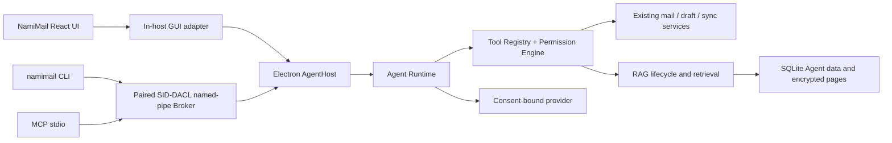

# Agent Architecture

[Chinese](architecture.zh-CN.md) | [English](architecture.en.md)

## Purpose and status

This page defines NamiMail Agent's production boundary and distinguishes the embedded GUI implementation from the shipped external CLI/MCP entry points and the standalone service mode that still fails closed.

> **Current-build status: external interfaces are available.** The 0.3.0 installer ships the `namimail` command, PATH shim, CLI, MCP stdio launcher, Broker, and pairing UI, and the installer smoke verifies the packaged MCP stdio path (protocol `2025-03-26`, serverInfo `NamiMail`, exactly fifteen tools: eight read-only and seven write). The CLI, MCP, and Broker in the diagram are working entry points behind a paired current-user SID-DACL named pipe. Standalone headless service mode still fails closed with `BROKER_SECURITY_UNAVAILABLE`. Experimental local NLLB-200 translation is unaffected and remains separate, explicit, and opt-in.

The normal server/runtime in the current source creates and starts an embedded `AgentService`, with GUI-facing `/api/agent` routes, an RAG worker, and a React workspace. Packaged-desktop validation of the CLI/MCP path is covered by the installer smoke. Real account/provider paths, deletion and rebuild lifecycle checks, and security confirmation-flow validation still need live-environment evidence.

| Capability | Current status |
| --- | --- |
| Versioned contracts, tool registry, default-deny permissions, encrypted stores, conversation/audit/confirmation records, and RAG primitives | Independently implemented and tested |
| OpenAI-compatible and local Ollama provider adapter | A constrained adapter exists; runtime consent still decides whether mail content may leave the device |
| Transactional mail-state to source-event wiring | Connected in the current source to existing sync and mail-operation paths; real sync, deletion, and rebuild lifecycles still need release-grade validation |
| Embedded GUI Agent API, tool orchestration, and visible confirmation flow | Implemented in the current server/web source; source presence cannot replace packaged-desktop and security-confirmation-flow validation |
| SID-DACL Broker, Electron `main.mts` host wiring, and installed-app update drain | Shipped in 0.3.0: the desktop host creates the Broker and routes `--cli`; the installer smoke verifies the packaged MCP stdio path. Standalone headless service mode still fails closed |

## System boundary



In Windows desktop production mode, `AgentHost` is the sole process allowed to hold the DPAPI-unwrapped master key, open SQLite, schedule sync, manage the update lifecycle, and run the Agent. The renderer uses a GUI adapter in that host; its temporary token must never be accepted by CLI or MCP.

CLI/MCP reach the host only through a paired local Broker. Before a database is opened or migrations run, the Broker acquires an exclusive SID-DACL named-pipe lease restricted to the current Windows user SID. If a SID DACL cannot be proved, it returns `BROKER_SECURITY_UNAVAILABLE`; loopback TCP, HTTP, and direct SQLite are not fallbacks. The current build rejects standalone headless service mode for exactly this reason.

## Dependency direction

```text
agent-contracts <- agent-core <- server/agent <- server runtime
                                     ^               ^
                                     |               |
                              desktop broker --------+
                                     ^
                                     |
                                 CLI / MCP
```

- `packages/agent-contracts` defines versioned schemas, errors, events, and envelopes only.
- `packages/agent-core` depends only on those contracts and centralizes tool resolution and permission decisions.
- `apps/server/src/agent` may reuse mail models, but CLI/MCP must not import or open it directly.
- `apps/desktop` owns the host lease, paired transport, single-instance behavior, and update drain; it must not duplicate mail business rules.

## Request flow

1. An entry point creates an unforgeable `CallerContext` with caller identity, account scope, scopes, interactivity, and a request ID.
2. Runtime reads only mail context inside that scope. Mail and attachments are untrusted external data, never system instructions, authorization, or confirmation evidence.
3. A provider emits text or a tool call. Tool Registry validates the name and input; Permission Engine denies anything that does not meet policy.
4. Authorized reads may run. Draft and ordinary writes are audited; send, forward, permanent delete, bulk write, and mail-content egress create an immutable one-time GUI confirmation.
5. GUI renders the confirmation snapshot. Approval consumes a token exactly once only when caller, account generation, and content digest still match. Changes, expiry, rejection, or account deletion invalidate it.
6. Every entry point maps the same event sequence: status, text, tools, citations, confirmations, usage, errors, and completion. UI, CLI, and MCP do not orchestrate model output separately.

## Providers and translation

Providers are authorized by capability, not vendor name. The current source contains an OpenAI-compatible/Ollama adapter; other provider kinds are contract reservations and must not be presented as available before implementation and verification.

- Cloud mail-content egress is off by default. A user must explicitly consent in visible settings, and UI must name the provider, model, scope, and outgoing context.
- API keys belong only in secure credential storage or DPAPI-protected configuration, never ordinary settings, logs, browser state, or IPC output.
- Experimental local NLLB-200 translation is separate from Agent providers: opt-in and user-triggered, retaining its existing accuracy notice. It never automatically translates mail or sends content to a model.

## Update and failure boundary

On update, the drain gate rejects new Agent ingress, waits for active operations, closes runtime/database ownership, then releases the host lease. If drain or installer handoff fails, the previous host must be explicitly recovered or remain closed; an old Broker cannot continue using a database in update handoff.

Stable errors carry retryability and an actionable suggestion. Audit can associate `requestId`, caller, tool, scope, summary, and result, but must not record mail bodies, attachments, OAuth tokens, API keys, or passwords.

## Related documentation

- [Runtime](runtime.en.md)
- [Tools](tools.en.md)
- [Permissions and confirmations](permissions.en.md)
- [Conversations](conversations.en.md)
- [Security](security.en.md)
- [RAG architecture](../rag/architecture.en.md)
