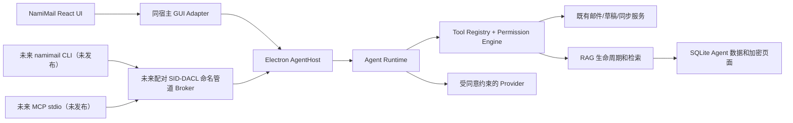

# Agent 架构

[简体中文](architecture.md) | [English](architecture.en.md)

## 目的与状态

本页定义 NamiMail Agent 的生产边界，并区分当前源码中的嵌入式 GUI 实现与尚未发布的外部入口。

> **当前构建状态：外部 Agent 接口不可用。** 当前 Windows 构建没有可验证的 SID-DACL 命名管道原生适配器，会在启动外部 AgentHost、Broker、CLI 或 MCP 之前失败关闭。图中的 CLI、MCP 和 Broker 是未来发布的安全边界，不是当前可用入口；没有 `namimail` 命令、PATH shim、配对 UI 或 MCP 启动器。实验性的本地 NLLB-200 翻译不受此状态影响，仍保持独立、主动和可选。

当前常规 server/runtime 已创建并启动嵌入式 `AgentService`，提供 GUI 使用的 `/api/agent` 路由、RAG 工作者和 React 工作区。该源码实现不等于发布级证明：仍需对打包桌面版、真实账户/Provider 路径、删除与重建生命周期以及安全确认流完成验证。

| 能力 | 当前状态 |
| --- | --- |
| 版本化契约、工具注册、默认拒绝权限、加密存储、会话/审计/确认记录、RAG 基础构件 | 已有独立实现和测试 |
| OpenAI 兼容与本地 Ollama 的 Provider 适配器 | 已有受限适配器；是否允许邮件内容外发仍由运行时同意设置决定 |
| 邮件状态到来源事件的事务接线 | 当前源码已接入既有同步和邮件操作路径；真实同步、删除和重建生命周期仍需发布级验证 |
| 嵌入式 GUI Agent API、工具编排和用户可见确认流程 | 当前 server/web 源码已有实现；不能以源码存在替代打包桌面版和安全确认流程的功能验证 |
| SID-DACL Broker、Electron `main.mts` 宿主接线、安装版更新排空 | 当前构建未发布；缺少可验证原生适配器时会在任何外部入口前失败关闭 |

## 系统边界



在 Windows 桌面生产环境中，`AgentHost` 是唯一可以持有 DPAPI 解封主密钥、打开 SQLite、调度同步、管理更新生命周期和运行 Agent 的进程。渲染器使用同一宿主内的 GUI Adapter；其临时令牌绝不能被 CLI 或 MCP 接受。

该接口发布后，CLI/MCP 只能经已配对的本地 Broker 到达宿主。Broker 必须在打开数据库或运行迁移之前取得只允许当前 Windows 用户 SID 的独占命名管道租约。无法证明 SID DACL 时，必须返回 `BROKER_SECURITY_UNAVAILABLE`，不得回退到 loopback TCP、HTTP 或直接 SQLite；当前构建正因此要求拒绝外部入口。

## 依赖方向

```text
agent-contracts <- agent-core <- server/agent <- server runtime
                                     ^               ^
                                     |               |
                              desktop broker --------+
                                     ^
                                     |
                                 CLI / MCP
```

- `packages/agent-contracts` 只定义可版本化的 schema、错误、事件和信封。
- `packages/agent-core` 只依赖契约，集中执行工具解析与权限判断。
- `apps/server/src/agent` 可以复用邮件数据模型，但 CLI/MCP 不可直接导入或打开它。
- `apps/desktop` 只负责宿主租约、配对传输、单实例和更新排空；它不能重写邮件业务规则。

## 一次请求的流程

1. 入口构造不可伪造的 `CallerContext`，包含调用方、账户范围、scope、交互能力和 request ID。
2. Runtime 只读取该范围内的邮件上下文。邮件与附件都是外部不可信数据，不可成为系统指令、权限或确认依据。
3. Provider 产生文本或工具调用；Tool Registry 校验工具名与参数，Permission Engine 默认拒绝不满足条件的调用。
4. 只读操作可在授权后执行。草稿与普通写入需要审计；发送、转发、永久删除、批量写入和外发邮件内容必须创建不可变的一次性 GUI 确认。
5. GUI 展示确认快照。批准只能消费与 caller、账户代际和内容摘要完全一致的 token 一次；修改、超时、拒绝或账号删除均使其失效。
6. 所有入口映射同一事件序列：状态、文本、工具、来源、确认、用量、错误和完成，避免 UI、CLI、MCP 各自编排模型结果。

## Provider 与翻译

Provider 使用能力模型，而非以厂商名称授权。当前代码包含 OpenAI-compatible/Ollama 适配器；其他 Provider 仅是契约保留，未经实际实现和验证不得标记为可用。

- 云端 Provider 的邮件内容外发默认关闭。用户必须在可见设置中明确同意，界面应显示 Provider、模型、范围和将发送的上下文。
- API key 只可位于安全凭据存储或由 DPAPI 保护的配置中，不能写入普通设置、日志、浏览器状态或 IPC 输出。
- 实验性本地 NLLB-200 翻译与 Agent Provider 完全分离：可选、主动触发、保留现有不准确提示，不会自动翻译邮件或自动向模型发送内容。

## 更新与故障边界

更新开始时，排空闸门先拒绝新 Agent 入口，再等待已有操作结束、关闭运行时和数据库、最后释放宿主租约。排空或安装器交接失败时，只能显式恢复先前宿主或保持关闭；绝不能让旧 Broker 继续访问已开始更新的数据库。

稳定错误码必须包含是否可重试和可执行建议。审计可关联 `requestId`、调用方、工具、范围、摘要和结果，但不得记录邮件正文、附件、OAuth token、API key 或密码。

## 相关文档

- [运行时](runtime.md)
- [工具](tools.md)
- [权限与确认](permissions.md)
- [会话](conversations.md)
- [安全](security.md)
- [RAG 架构](../rag/architecture.md)
