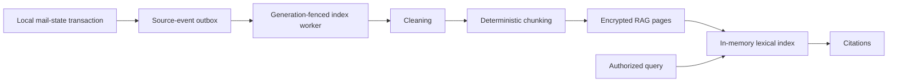

# RAG Architecture

[Chinese](architecture.md) | [English](architecture.en.md)

## Goal

NamiMail RAG provides citeable local retrieval over authorized mail. It does not create a persistent vector service detached from the mailbox lifecycle, replace IMAP sync or the mail database, or treat a retrieval hit as write authorization.

## Components

| Layer | Persistence | Key boundary |
| --- | --- | --- |
| Mail primary data | Existing mail SQLite | Still owned by IMAP/mail services |
| Source events | Agent SQLite outbox | Enqueued in the same transaction as local mail state |
| RAG pages | Per-account DEK encryption | Rebuildable from source events |
| Lexical index | Memory only | No second plaintext or standalone vector store |
| Citations | Structured metadata/necessary excerpt | Links back to authorized mail or page |

## Account isolation

Each page carries `account_id`, `account_generation`, page ID, revision, state, content digest, and encrypted payload. Queries, workers, conversations, and citations all require the current generation. Account deletion advances generation, cancels old work, and discards its DEK, so old pages cannot be decrypted even if physical rows remain.

## Current implementation and validation boundary

Cleaning, chunking, encrypted page storage, source events, generation lifecycle, citations, and lexical retrieval have independently testable implementations. The normal server/runtime also starts `AgentService` and its RAG worker, while existing sync/mail-state paths write message source events and the embedded GUI query path consumes retrieval results. There is no production semantic/embedding index or attachment-body ingestion. That wiring exists in the current source, but it is not release-grade user-feature proof: the same build still requires packaged-desktop, real account/provider, deletion and rebuild lifecycle, and security confirmation-flow validation.

## Non-goals

- No browser-reachable RAG HTTP service.
- No current embedding pipeline; any future cloud content requires separate consent.
- No long-lived plaintext, vector, or attachment copy outside the account-DEK lifecycle.
- No bypass of account scope, mail state, or user confirmation based on a retrieval result.

See [Ingestion](ingestion.en.md), [Retrieval](retrieval.en.md), and [Consistency](consistency.en.md).
