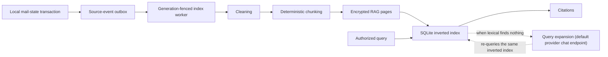

# RAG Architecture

[Chinese](architecture.zh-CN.md) | [English](architecture.en.md)

## Goal

NamiMail RAG provides citeable local retrieval over authorized mail. It does not create a persistent vector service detached from the mailbox lifecycle, replace IMAP sync or the mail database, or treat a retrieval hit as write authorization.

## Components

| Layer | Persistence | Key boundary |
| --- | --- | --- |
| Mail primary data | Existing mail SQLite | Still owned by IMAP/mail services |
| Source events | Agent SQLite outbox | Enqueued in the same transaction as local mail state |
| RAG pages | Per-account DEK encryption | Rebuildable from source events |
| Lexical index | SQLite inverted table (inside the Agent store, `agent_rag_index`/`agent_rag_index_stats`) | Derived tokens and tf counts only, no message plaintext; incrementally rebuildable from encrypted pages |
| Query expansion | None (no index) | On an empty lexical result the default chat provider supplies search terms that re-query the same inverted index; only the question text is sent, never mail content |
| Citations | Structured metadata/necessary excerpt | Links back to authorized mail or page |

## Account isolation

Each page carries `account_id`, `account_generation`, page ID, revision, state, content digest, and encrypted payload. Queries, workers, conversations, and citations all require the current generation. Account deletion advances generation, cancels old work, and discards its DEK, so old pages cannot be decrypted even if physical rows remain.

## Current implementation and validation boundary

Cleaning, chunking, encrypted page storage, source events, generation lifecycle, citations, lexical retrieval, and query expansion have independently testable implementations. The lexical index is persisted as SQLite inverted tables inside the Agent store (`agent_rag_index`/`agent_rag_index_stats`), holding only derived tokens and tf counts with no message plaintext; queries fetch postings per term and score them with BM25, decrypting payloads only for the top candidate pool, and warm-up after a restart backfills only the missing pages instead of decrypting the whole account. The second arm is **query expansion** (triggered when the lexical arm is empty or below threshold): the default chat provider supplies search terms that re-query the same inverted index, sending only the user's question text (cloud providers still require explicit authorization for cloud mail content) and producing no index-side storage. The normal server/runtime also starts `AgentService` and its RAG worker, while existing sync/mail-state paths write message source events and the embedded GUI query path consumes retrieval results. There is no attachment-body ingestion. That wiring exists in the current source, but it is not release-grade user-feature proof: the same build still requires packaged-desktop, real account/provider, deletion and rebuild lifecycle, and security confirmation-flow validation.

## Non-goals

- No browser-reachable RAG HTTP service.
- The second arm is enabled by authorization: only the user's question text goes to the default chat provider; local endpoints such as Ollama never egress, and cloud endpoints require explicit authorization for cloud mail content. Mail bodies and excerpts never egress.
- No long-lived plaintext or attachment copy outside the account-DEK lifecycle.
- No bypass of account scope, mail state, or user confirmation based on a retrieval result.

See [Ingestion](ingestion.en.md), [Retrieval](retrieval.en.md), and [Consistency](consistency.en.md).
