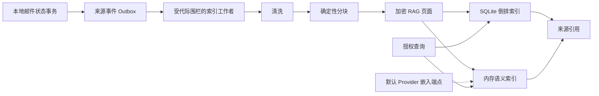

# RAG 架构

[简体中文](architecture.zh-CN.md) | [English](architecture.en.md)

## 目标

NamiMail RAG 为已授权邮件提供可引用的本地检索，不建立一个脱离邮箱生命周期的常驻向量服务。它不替代 IMAP 同步或邮件数据库，也不把检索命中当成写入授权。

## 组成

| 层 | 持久化 | 关键边界 |
| --- | --- | --- |
| 邮件主数据 | 既有邮件 SQLite | 仍由 IMAP/邮件服务拥有 |
| 来源事件 | Agent SQLite Outbox | 与本地邮件状态在同一事务入队 |
| RAG 页面 | 每账号 DEK 加密 | 可由来源事件重建 |
| 词法索引 | SQLite 倒排表（Agent store 内，`agent_rag_index`/`agent_rag_index_stats`） | 只存派生 token 与 tf 计数，无正文明文；可由加密页面增量重建 |
| 语义索引 | 仅内存 | 向量不落盘；仅由用户配置的默认 Provider 嵌入端点填充 |
| 引用 | 结构化元数据/必要片段 | 回链到受授权的邮件或页面 |

## 账户隔离

每个页面携带 `account_id`、`account_generation`、页面 ID、修订、状态、内容摘要和加密 payload。查询、工作者、会话和引用均需要当前代际。账户删除推进 generation、取消旧任务并丢弃 DEK 后，旧页面即使物理文件仍存在也不可解密。

## 当前实现与验证边界

清洗、分块、加密页面存储、来源事件、代际生命周期、引用、词法检索与可选语义检索已有可单测实现。词法索引持久化为 Agent store 的 SQLite 倒排表（`agent_rag_index`/`agent_rag_index_stats`），只存分词 token 与 tf 计数、不落正文明文；查询按词取 postings 后用 BM25 打分，仅对 top 候选池解密 payload，重启后 warm 只增量补齐缺失页、不再整账户全量解密。语义检索由默认模型 Provider 的嵌入端点驱动（`openai-compatible`/`ollama` 类型；云端端点需显式授权云端邮件内容），向量仅存进程内。当前常规 server/runtime 还会启动 `AgentService` 及其 RAG 工作者，并由既有同步/邮件状态路径写入消息来源事件；嵌入式 GUI 查询路径会使用这些检索结果。当前没有附件正文摄取。该接线存在于当前源码，但尚不是发布级用户功能证明：同一版本仍必须完成打包桌面版、真实账户/Provider、删除与重建生命周期和安全确认流验证。

## 非目标

- 不另启浏览器可访问的 RAG HTTP 服务。
- 语义检索按授权启用：邮件文本仅发往用户配置的默认 Provider 嵌入端点；Ollama 等本机端点永不外发，云端端点必须显式授权云端邮件内容。
- 不保留与账户 DEK 生命周期无关的长期明文、向量或附件副本。
- 不用检索结果绕过账户范围、邮件状态或用户确认。

参见 [摄取](ingestion.zh-CN.md)、[检索](retrieval.zh-CN.md) 和 [一致性](consistency.zh-CN.md)。
